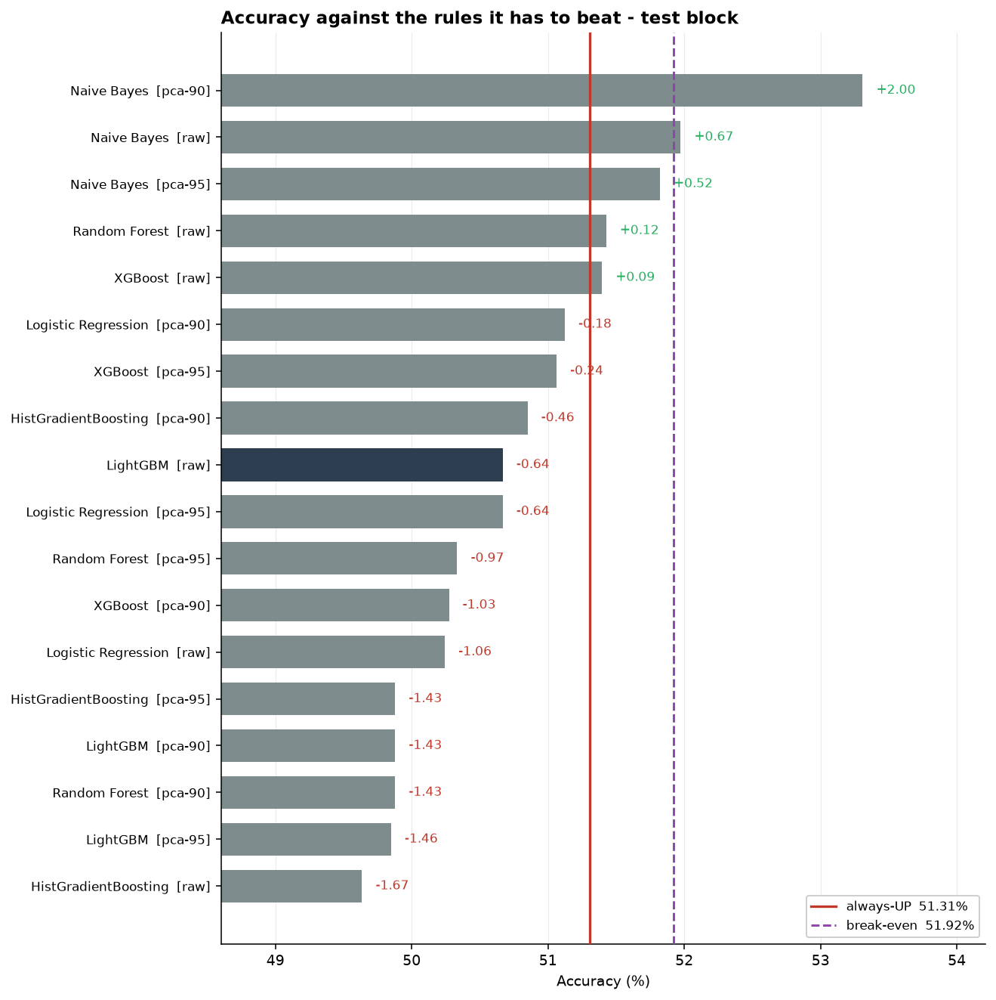

# forecast-lab

**Quantitative research on short-horizon market direction.** A symbol-agnostic pipeline that measures what an experiment can actually resolve *before* it claims an edge.

> Re-engineering of a postgraduate project (MSc in Data Science and Engineering, CUCEI, University of Guadalajara, 2025), originally carried out as a team notebook. See [Origin and scope](#origin-and-scope-of-the-re-analysis).

**→ [FINDINGS](FINDINGS.md) - the answer, in one place.** What was established, what was not, and what would change it.

---

## The finding that started this

The original analysis reported a model that beat chance: **51.53% accuracy**. The technical report written around the notebook presented it as evidence that *"es posible construir modelos de Machine Learning que superen el azar"* on hourly gold direction, and the presentation script went further: *"logramos construir un modelo funcional que supera el azar"*.

**The notebook itself said something more careful**, and this repository spent its first twelve commits not noticing the difference. Its concluding cell reads: *"el modelo **NO alcanza** niveles de rendimiento suficientes para trading automatizado"*, and *"los resultados modestos (AUC ~0.5) son consistentes con la teoría de mercados eficientes"*. That is close to what this project concludes. **The analysis was more honest than its communication** - which is a finding in itself, and the one an audit had to point out ([STATUS](docs/status/STATUS-2026-09-parity.md) sec. 2.3).

Its own classification report printed the answer two lines below:

```
              precision    recall  f1-score   support
    DOWN (0)     0.4955    0.3795    0.4298      1436
      UP (1)     0.5268    0.6412    0.5784      1547
    accuracy                         0.5153      2983    <- the model
                                     0.5186            <- predicting UP every time
```

With 1,547 of 2,983 test bars going up, **always predicting UP scores 51.86%**. The celebrated model loses to the most trivial baseline there is, by 0.33 points. The number that refutes it was on the same screen as the number that was believed.

That is not a story about one careless project. It is what happens when a pipeline has no baseline, no power analysis, and no separation between choosing a model and testing it. This repository rebuilds the experiment so those three things are impossible to skip.

## What the corrected pipeline finds

Rebuilt end to end - labels on an explicit horizon, a purged split, features that carry no price level, every transform fitted on train alone, selection on validation - and run on two independent datasets:

| | reference (23,181 bars) | canonical (51,147 bars) |
|---|---|---|
| Model selected on validation | XGBoost | Random Forest |
| Its edge over always-UP, on test | **-0.21%** | **+0.15%** |
| Minimum detectable effect (80% power) | 2.17% | **1.45%** |
| Configurations clearing break-even | 1 of 18 | **0 of 18** |
| Range of AUC across 18 configurations | 0.491 - 0.527 | **0.503 - 0.516** |

**The sign flips between datasets and both results sit far inside the noise.** That is the finding: at this effect size the sign carries no information - and the original analysis reported a difference of the same order and read it as a discovery.

What is established firmly: **nothing tested reaches the accuracy at which trading would pay for its own costs** - measured against each model's own turnover rather than an assumed one, the closest falls short by **0.46 points**.

**Scored across the whole history rather than one block**, five expanding folds covering 2019-06 to 2026-08 score six models over **40,587 bars**. None clears the accuracy that pays for its own costs. The closest is **Naive Bayes at 50.77% against 51.23%** - short by **0.46 points, 1.86 standard errors** - and it gets there by trading least, holding each position 5.7 bars ([STATUS](docs/status/STATUS-2026-08-turnover.md)).

### And the answer to the question underneath

Two questions had to be separated before either could be answered, because they turn out to disagree.

| | Test | Answer |
|---|---|---|
| **Is there skill?** | Pesaran-Timmermann, corrected with Holm | **Yes. 9 of 18** configurations survive; the best at z = 4.61 |
| **Does anything make money?** | Net of the venue's own spread | **No. 0 of 18**, under either position framing |
| **Does anything beat holding gold?** | Hansen SPA | **No.** p = 0.761 |
| **Does the best survive being the best?** | Romano-Wolf StepM, Deflated Sharpe | **No.** StepM rejects nothing; DSR = 0.0000 |

**There is a real directional edge and it is worth less than nothing.** Nine configurations carry a
statistically robust signal of about one point of directional accuracy, corrected for having tried
eighteen. Traded, those same models turn buy-and-hold's **+100.9%** into **-86.9%** over the same
40,587 bars. One point of accuracy costs more to collect than it is worth
([ADR-013](docs/adr/ADR-013-skill-and-profit-are-separate-questions.md),
[STATUS](docs/status/STATUS-2026-08-verdict.md)).

That is a better answer than either half. *"There is no signal"* would have been wrong; *"we found an
edge"* would have been true and dangerously incomplete. What the data supports is that the market is
not perfectly efficient at this horizon, and the inefficiency is smaller than the cost of exploiting
it - which is what an efficient market with frictions is supposed to look like.

**The ordering inverts once turnover is measured**, which is the sharpest thing in the project after the selection result. By accuracy, HistGradientBoosting wins at 51.23% and Naive Bayes is fifth. By whether it pays for itself, Naive Bayes is closest by a full point, because a persistent model crosses the spread half as often and faces a threshold **1.45 points lower**. Ranking by accuracy was ranking by the wrong criterion ([ADR-012](docs/adr/ADR-012-turnover-and-dependence-are-measured.md)).

And that run contains a trap worth stating, because it is this project's own thesis pointed back at itself: under walk-forward **all six edges turn positive**, which looks like the models improving. They are not. Accuracy *falls* 0.21 points; the **baseline falls 0.67**, because averaging five stretches of history moves the majority class nearer a half. The edge moved because the thing it is measured against moved.



**And the sharpest number the project has produced is about procedure, not about gold.** Selecting on validation gives -0.21% on test; selecting by *looking at* test - which is what the original notebook does - gives **+1.85%**. Same data, same eighteen configurations: **2.06 points that hang entirely on when the test set is consulted**, which is larger than any effect anyone here is trying to detect.

Two more things fell out of building it:

- **Adding two feature columns changed which model wins**, from LightGBM to XGBoost, without changing any conclusion. If that is enough to move the winner among six models, then "LightGBM won" was never a fact about LightGBM ([STATUS](docs/status/STATUS-2026-08-models.md) sec. 5).
- **The original's headline correlation was mostly trend.** Gold against the S&P is +0.919 on price levels and **+0.139 on returns** - and two other pairs change sign between the two bases. Replicated on both datasets ([STATUS](docs/status/STATUS-2026-08-exploratory.md)).
- **Gold rises through the venue's pauses far more often than through an ordinary hour** - 59.35% against 50.87% on one dataset, 56.40% against 50.76% on the other. Replicated across two providers. It is not a strategy yet: those are precisely the hours that pay overnight financing.

## What this is, and is not

**It is** a reproducible measurement instrument: fetch public data, build features that survive a temporal split, and evaluate a prediction against baselines, transaction costs, and the honest question of whether the sample can detect the effect at all.

**It is not** a trading system, and it does not claim an edge. The intended outcome is a falsifiable verdict - including the verdict "this experiment cannot resolve the question", which is itself a result and is stated up front rather than discovered late.

## Why the sample size decides everything

Before modelling, two numbers are computed and pre-registered:

- **Break-even accuracy** - where a directional edge starts paying for its own costs. Computed from the venue's own quoted spread over 51,147 bars (a median round trip of **1.86 bps** against a 13.35 bps average move) **and from each model's own measured turnover**, which runs 17.6% to 38.4% rather than the 0.5 that was assumed. That gives **51.23% to 52.68%** depending on how often the model trades, not one shared 53.49% ([ADR-010](docs/adr/ADR-010-costs-are-measured-not-assumed.md), [ADR-012](docs/adr/ADR-012-turnover-and-dependence-are-measured.md)).
- **Minimum detectable effect** - the smallest edge the design can tell apart from luck.

| Validation design | Out-of-sample bars | MDE at 80% power | Power for a profitable edge |
|---|---:|---:|---:|
| Single split, reference data | 3,294 | 2.17% | 99.1% |
| Single split, canonical data | 7,306 | 1.45% | 100.0% |
| **Walk-forward, canonical data** | **40,587** | **0.62%** | **100.0%** |

**This table reversed an argument this project made for a week.** The claim was that a single split "cannot resolve the effect it exists to test" - a 2.17-point detection floor sitting above the 1.92 points a strategy would need. That was true against an *assumed* 1 bp round trip. Measured at the venue, costs demand more than that, and every design here sees it comfortably. At the shared threshold this project first used, detecting a profitable edge needed 1,268 bars; against the **1.23 points** the closest model actually has to clear once its own turnover is measured, it needs **10,216** - and there are 40,587 either way. The verdict is therefore not *"we could not see"* but **"we looked with power to spare"** ([ADR-011](docs/adr/ADR-011-power-before-verdict.md), [ADR-012](docs/adr/ADR-012-turnover-and-dependence-are-measured.md)).

What stays optimistic, named rather than buried: the standard error assumes independent bars, while overlapping feature windows make neighbours dependent. **100% power must not be read literally** until a stationary bootstrap corrects it. The conclusion does not rest on it - 0.97 against 3.49 points is arithmetic, not inference.

## Architecture

Four layers, dependencies pointing inward:

```
interfaces --+--> ingest ----+
             |               +--> contracts
             +--> research --+
```

The load-bearing rule: **`research` never reaches for data.** It receives frames and cannot open a file or call an API. A layer that can quietly re-read the world produces results that cannot be reproduced from stored inputs, and a result that cannot be reproduced cannot be falsified. This is enforced by [`tests/test_layering.py`](tests/test_layering.py), not by convention.

Details and the reasoning: [ADR-001](docs/adr/ADR-001-hexagonal-architecture.md).

## Quickstart

```bash
uv sync                    # install runtime and dev dependencies
uv run forecast-lab --help
```

Data is **not** committed - it is regenerable. Nothing else works until you fetch it:

```bash
uv run forecast-lab fetch     # public CDN, no API key, no registration
uv run forecast-lab symbols   # what is now available on disk
uv run forecast-lab verify    # does it still match the committed manifest?
```

Then put several symbols on one timeline, anchored to the one being predicted:

```bash
uv run forecast-lab align --target XAUUSD --timeframe 1H
```

It reports what had to be carried forward and how old it was, per symbol - which is the
difference between "the S&P is at 4,500" and "the S&P was at 4,500, sixteen hours ago".

Then label the target, cut the timeline, and score the rules a model has to beat:

```bash
uv run forecast-lab explore  --target XAUUSD --timeframe 1H --dir data/raw
uv run forecast-lab baseline --target XAUUSD --timeframe 1H --dir data/raw
uv run forecast-lab features --target XAUUSD --timeframe 1H --dir data/raw --mode whole
uv run forecast-lab train    --target XAUUSD --timeframe 1H --dir data/raw --figures docs/status/figures
```

`--dir data/raw` is not optional after a `fetch`: those four read `data/reference` by
default, because the published figures were computed there. The two directories hold
different datasets and the commands will not silently mix them.

Then score every model across the whole history, with the detection floor that says
whether the answer means anything:

```bash
uv run forecast-lab validate --target XAUUSD --timeframe 1H
```

This one defaults to `data/raw` rather than `data/reference`, because the reference
exports are too short to cut into useful folds and carry no spread column - so the
break-even would fall back to an assumption. The command prints which threshold it used.

**Every** analysis command - `align`, `explore`, `features`, `baseline`, `train` and
`validate` - offers `--json`, because the dashboard is going to run them rather than
reimplement them ([ADR-005](docs/adr/ADR-005-the-dashboard-runs-the-cli.md)), and those
payload shapes are pinned by tests rather than by intention.

To reproduce the baseline this project corrects, point `ingest` at the original
project's exports; they are read once and never feed the engine:

```bash
uv run forecast-lab ingest --from <path to the exports>
```

And the dashboard, which runs those same commands as subprocesses and prints each one
beneath the result it produced:

```bash
uv sync --extra dashboard
uv run forecast-lab dashboard
```

Seven pages over the CLI, importing nothing from `research` - a rule two layering guards
enforce, because a dashboard that could call the analysis directly would eventually compute
a number differently from the terminal, and the copy that drifts is the one nobody runs the
gates against ([ADR-005](docs/adr/ADR-005-the-dashboard-runs-the-cli.md)).

The three quality gates, which every change must leave green:

```bash
uv run ruff check src tests
uv run python -m mypy --strict src tests
uv run python -m pytest -q
```

## Documentation

Written as a research book: each document exists because a decision was made, and records the reasoning and the trade-off rather than just the outcome.

| | |
|---|---|
| [**FINDINGS**](FINDINGS.md) | **The answer**: what the project establishes, what it does not, and what would change it |
| [Documentation index](docs/INDEX.md) | One line per file - find the right document without opening it |
| [RUNBOOK](docs/guides/RUNBOOK-getting-started.md) | **Start here to run it**: fresh clone to feature matrix, and what to do when a step fails |
| [Engineering conventions](docs/guides/engineering-conventions.md) | The rules, and why each exists |
| [ADR-001](docs/adr/ADR-001-hexagonal-architecture.md) | The architecture, and the abstractions deliberately not built |
| [ADR-002](docs/adr/ADR-002-data-source-and-symbol-set.md) | The data source and the symbol set |
| [ADR-003](docs/adr/ADR-003-target-anchored-alignment.md) | The target's bars are the timeline, and nothing may extend it |
| [ADR-004](docs/adr/ADR-004-labels-splits-and-baselines.md) | What a bar's answer is, where the boundaries fall, and what a model must beat |
| [ADR-005](docs/adr/ADR-005-the-dashboard-runs-the-cli.md) | The dashboard runs the CLI rather than reimplementing it |
| [ADR-006](docs/adr/ADR-006-features-and-stationarity.md) | Indicators before alignment, and no column that carries a price |
| [ADR-007](docs/adr/ADR-007-fitting-models-without-leaking.md) | Fitting on train, selecting on validation, scoring test once |
| [ADR-008](docs/adr/ADR-008-figures-are-built-in-memory.md) | Figures are built in memory and committed as PNG |
| [ADR-009](docs/adr/ADR-009-exploratory-analysis.md) | What exploratory analysis is for, and how it goes wrong quietly |
| [ADR-010](docs/adr/ADR-010-costs-are-measured-not-assumed.md) | The cost of trading is measured from the venue, not assumed |
| [ADR-011](docs/adr/ADR-011-power-before-verdict.md) | A negative result is only a finding if the design could have seen the effect |
| [ADR-012](docs/adr/ADR-012-turnover-and-dependence-are-measured.md) | The last two assumed parameters, measured - one flattered the conclusion, one undermined it |
| [ADR-013](docs/adr/ADR-013-skill-and-profit-are-separate-questions.md) | Skill and profit are separate questions, and they get separate answers |
| [STATUS 2026-08-18](docs/status/STATUS-2026-08-dukascopy-probe.md) | The data probe: instrument identity confirmed, and why VIX was dropped |
| [STATUS 2026-08-23](docs/status/STATUS-2026-08-notebook-baseline.md) | The baseline recomputed from data, and the 59% of gaps nobody had measured |
| [STATUS 2026-08-24](docs/status/STATUS-2026-08-features.md) | The feature matrix, and a guard that real data corrected twice |
| [STATUS 2026-08-24](docs/status/STATUS-2026-08-models.md) | **The result**: nothing beats a constant by a detectable margin, on either dataset |
| [STATUS 2026-08-27](docs/status/STATUS-2026-08-exploratory.md) | The EDA: three findings that dissolve, and a +0.923 correlation that is +0.13 |
| [STATUS 2026-08-27](docs/status/STATUS-2026-08-walk-forward.md) | **The firmest test**: 40,587 bars, with the power to mean it |
| [STATUS 2026-08-28](docs/status/STATUS-2026-08-turnover.md) | **The correction**: turnover was assumed, and the margin was two and a quarter points too generous |
| [STATUS 2026-08-30](docs/status/STATUS-2026-08-verdict.md) | **The answer**: a real edge, worth less than nothing - 9 of 18 survive Holm, 0 of 18 make money |
| [CHANGELOG](CHANGELOG.md) | Notable changes, newest first |

## Status

The pipeline runs end to end and now answers the question it was built to answer: data in, verified, onto one timeline without a fabricated row, labelled, split, turned into features that carry no price level, fitted, priced against the venue's own spread, and scored across nine years of history with a stated detection floor. The research question is answered, the verdict is stated in [FINDINGS](FINDINGS.md), and the dashboard runs. What remains is the gap benchmark that has been owed since [ADR-010](docs/adr/ADR-010-costs-are-measured-not-assumed.md) - the only hypothesis this project has never tested - and a rewrite of the original technical report. The order was deliberate: the original went wrong before any model was fitted, so the corrections came first.

- [x] Architecture, data source and symbol set decided and recorded
- [x] Contracts, the layering guard, and the `symbols` command
- [x] Reading boundary, provenance manifest, `ingest` and `verify`
- [x] `fetch`: both offer sides, with the per-bar spread
- [x] Target-anchored alignment (the correction at the heart of the re-analysis)
- [x] Labels on an explicit horizon, a purged chronological split, and the three baselines
- [x] Features with an enforced stationarity policy, checked by rescaling rather than by name
- [x] Models: six estimators, PCA, selection on validation, scored against the baselines
- [x] Figures: the comparison the original could not draw, committed as PNG
- [x] The cost model and the power analysis, computed rather than carried
- [x] Walk-forward validation, and the detection floor that tells a null result from a blind one
- [x] Turnover and serial dependence measured rather than assumed, and the margin corrected
- [x] The composition root under test, `--json` everywhere, and PCA scored across folds
- [x] The significance battery, and the verdict it produces
- [x] `FINDINGS`, and the dashboard that runs the CLI rather than reimplementing it
- [ ] The gap benchmark against the overnight swap - the last untested hypothesis

## Origin and scope of the re-analysis

The underlying question, the asset universe and the first pipeline come from a postgraduate team project completed in December 2025. That work is the **baseline** this repository reproduces and corrects; it is published with the consent of its co-author.

Everything else is later, independent work: the architecture, the nine methodological corrections, the change of data source, the power analysis, the evaluation battery, and the verdict. Where a finding contradicts the original conclusions, that is stated plainly - the point of the exercise is the correction, not the embarrassment.

## License

[MIT](LICENSE).
