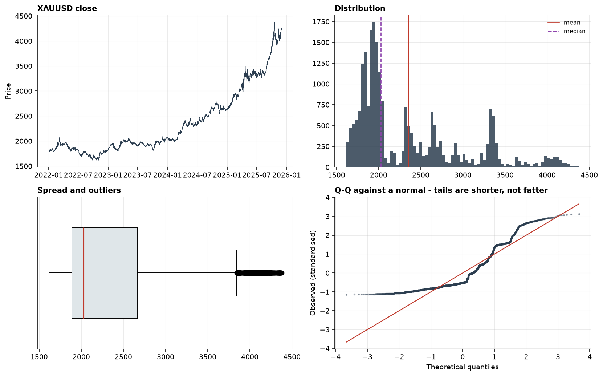
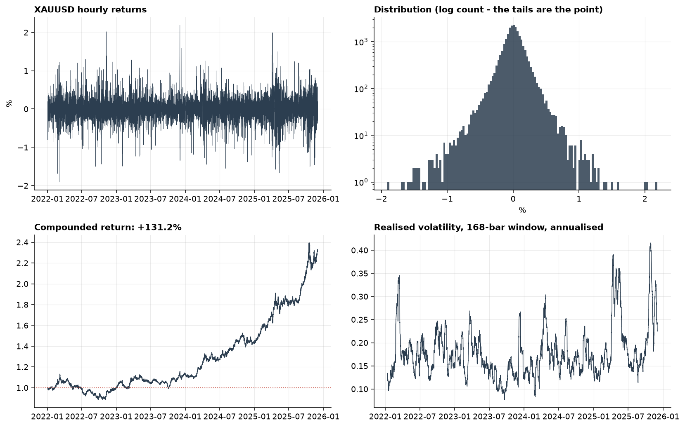
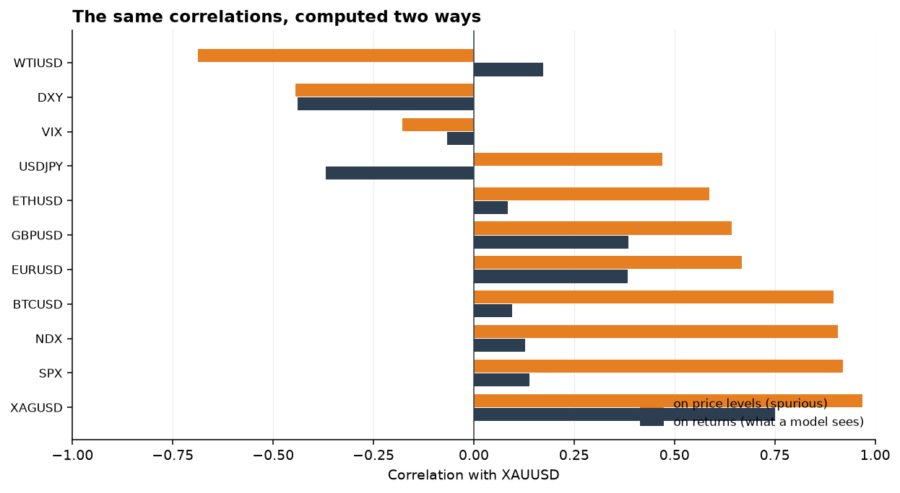
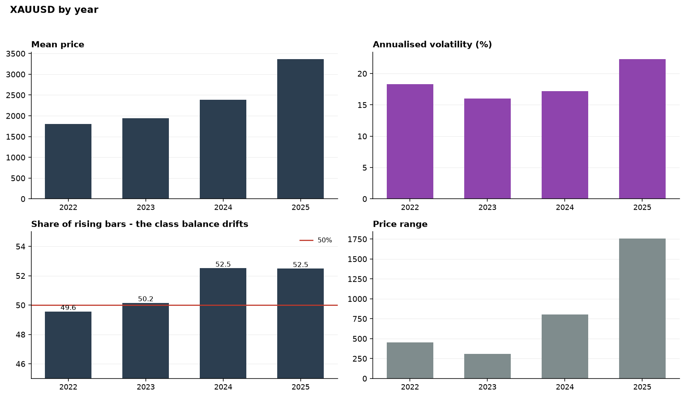
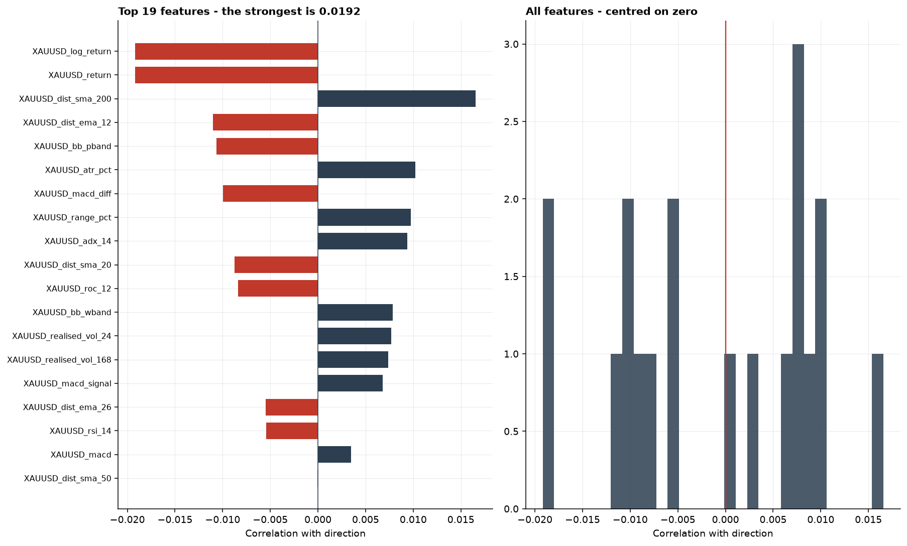
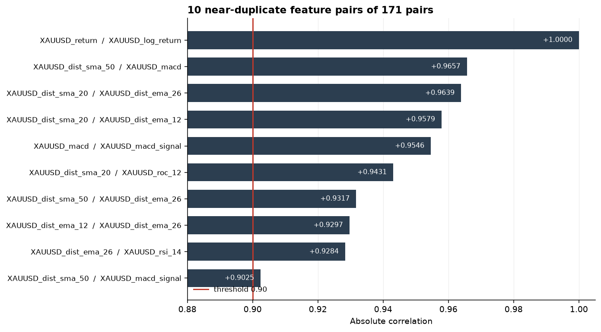
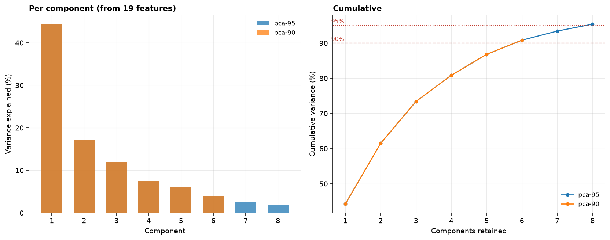

# STATUS 2026-08-27 - The exploratory analysis, and three tests that answered nothing

- **Question:** the original project's EDA ran the right procedures and computed them correctly. Does re-running them change anything, or was the analysis sound and only the modelling wrong?
- **Verdict:** **Three of its findings dissolve, and one of them reverses.** The gold-S&P correlation of +0.923 that its report reads as an economic relationship is +0.13 once computed on returns. Its normality test was pointed at the price rather than at returns. And its t-test compared the variable that defined the groups being compared, so it could not have failed.
- **Commands:** `forecast-lab explore --target XAUUSD --timeframe 1H --dir data/reference` and the same on `--dir data/raw`
- **Machine-readable output:** [eda-summary.json](eda-summary.json), [eda-summary-canonical.json](eda-summary-canonical.json)

## 1. What the data is

Measured on the reference exports, 23,181 hourly bars from 2022-01 to 2025-12:

| | Value |
|---|---:|
| Mean / median | 2,354.44 / 2,024.58 |
| Standard deviation | 647.63 |
| Range | 2,761.34 |
| IQR | 783.37 |
| Skewness / kurtosis | 1.156 / 0.366 |
| Low | 1,616.66 on 2022-09-28 |
| High | 4,378.00 on 2025-10-20 |
| Total change | **+2,399.21 (+131.22%)** |
| Hourly moves | 11,857 up, 11,285 down, 38 flat - **51.15% rose** |

The +131% is the number to keep in view through everything that follows. Gold roughly doubled across the sample, so any strategy with a long bias inherits a large return that has nothing to do with prediction - which is why buy-and-hold is a mandatory benchmark once the cost model exists.

## 2. The normality test, and the variable it should have been pointed at

The original runs D'Agostino-Pearson on the price and reports that the data are not normal. Both series reject, so the p-values alone say the same thing about each:

| | Statistic | p |
|---|---:|---:|
| Price | 3,484.9 | 0.000 |
| Returns | 4,092.0 | 0.000 |

**The Q-Q panel says what the p-values cannot:**

| | Lower tail | Upper tail |
|---|---:|---:|
| Normal, theoretical | -3.66 | +3.66 |
| Price | **-1.14** | +3.12 |
| Returns | **-9.57** | **+10.94** |

The price fails for having tails that are **too short** - it is bounded below and was trending, so it cannot produce the excursions a normal predicts. Nothing follows from that. The returns fail for reaching roughly **ten standard deviations** where a normal reaches 3.7, and that has a consequence: it is why a Sharpe ratio's textbook confidence interval is wrong on this data, and why the evaluation layer will need a stationary bootstrap rather than a t-statistic.

Same test, same rejection, opposite meanings.





## 3. The t-test that could not fail

The original computes:

```
df_raw['Price_Change'] = df_raw['Future_Price'] - df_raw['XAUUSD_Close']
df_raw['Direction']    = (df_raw['Price_Change'] > 0).astype(int)
...
up_data   = df_analysis[df_analysis['Direction'] == 1]
down_data = df_analysis[df_analysis['Direction'] == 0]
t_stat, p_value = ttest_ind(up_data['Price_Change'], down_data['Price_Change'])
```

**`Direction` is defined as the sign of `Price_Change`, and the test then compares `Price_Change` between the two groups that definition created.** The UP group cannot contain a negative value. The test returns p < 0.001 and "Significativo: S", and the report's interpretation section reads it as evidence about how rises and falls differ.

It is the same class of error as computing AUC from hard labels: a correct procedure applied to a question that already had its answer. A test in this repository reproduces it - p < 1e-100 on the leaking column, p > 0.01 on an honest one measured beside it - so the warning in `compare_by_direction`'s docstring carries evidence rather than an assertion.

## 4. Correlations: what was a relationship and what was a trend

The original reports gold against the S&P at **+0.923** and reads it as an economic finding. Recomputed on returns, which is what a model at this horizon consumes:

| | On levels | On returns | Inflated by |
|---|---:|---:|---:|
| XAGUSD | +0.968 | **+0.750** | +0.218 |
| SPX | **+0.919** | **+0.139** | +0.780 |
| NDX | +0.908 | +0.128 | +0.779 |
| BTCUSD | +0.896 | +0.095 | **+0.801** |
| WTIUSD | **-0.688** | **+0.173** | +0.514 |
| EURUSD | +0.668 | +0.383 | +0.286 |
| USDJPY | +0.469 | **-0.368** | +0.101 |
| DXY | -0.444 | -0.439 | **+0.005** |

**Eight tenths of the gold-S&P correlation is shared trend.** Both went up over the same four years; that is the whole of it.

**Two pairs change sign.** On levels WTIUSD appears to move *against* gold (-0.688) while on returns it moves *with* it (+0.173). USDJPY is the reverse. A reading based on the level would have been backwards in both cases.

**And DXY barely moves at all** (+0.005 of inflation). The dollar is the one genuine relationship in the table, negative and stable - and it is the one the original's EDA did not highlight, because on levels it looked weaker than the S&P.



## 5. The replication, which is the strongest part

Run on the canonical dataset - a different venue, 51,147 bars, nine years instead of four:

| | ref. levels | ref. returns | canon. levels | canon. returns |
|---|---:|---:|---:|---:|
| SPX | 0.919 | **0.139** | 0.919 | **0.131** |
| NDX | 0.908 | 0.128 | 0.918 | 0.139 |
| XAGUSD | 0.968 | **0.750** | 0.952 | **0.767** |
| **DXY** | **-0.444** | -0.439 | **+0.195** | -0.414 |
| **WTIUSD** | **-0.688** | 0.173 | **+0.195** | 0.040 |

**Every returns correlation holds.** Silver 0.75 to 0.77, the S&P 0.13, the dollar -0.41 to -0.44. Those are properties of the instruments.

**Two level correlations change sign** - DXY from -0.444 to **+0.195**, WTIUSD from -0.688 to **+0.195** - purely from extending the window back to 2018. Nothing about gold, oil or the dollar changed. The shape of their shared trend did.

That is the cleanest statement of the point available: **a level correlation is a fact about the stretch of history you happened to look at.** A returns correlation is a fact about the assets.

## 6. The class balance drifts, and it matters downstream

| Year | Rose |
|---|---:|
| 2018 | 50.3% |
| 2019 | 50.6% |
| 2020 | 52.3% |
| 2021 | 50.1% |
| 2022 | 49.6% |
| 2023 | 50.1% |
| 2024 | 52.5% |
| 2025 | 52.6% |
| 2026 | 50.6% |

**Three points of spread across nine years**, and the effect this project is trying to detect is under two. Which years land in the test block therefore decides a meaningful part of any accuracy measured on it.

This is the `oracle_gap` of [ADR-004](../adr/ADR-004-labels-splits-and-baselines.md) sec. 5 seen from the data's side rather than the model's, and it is the argument for walk-forward validation stated without reference to any model at all.



## 7. Two measurements about the matrix

Not in the original's EDA in this form, and both bound what any model can do.

**The strongest single feature correlates with the direction at 0.0192.** Of nineteen columns, the best one barely leaves zero. No combination of them is going to produce a large edge, and that is knowable here rather than after eighteen model fits.

**Ten of 171 feature pairs exceed |0.9|:**

| Pair | Correlation |
|---|---:|
| `return` / `log_return` | **+1.0000** |
| `dist_sma_50` / `macd` | +0.9657 |
| `dist_sma_20` / `dist_ema_26` | +0.9639 |
| `macd` / `macd_signal` | +0.9546 |
| `dist_ema_26` / `rsi_14` | +0.9284 |

`return` and `log_return` are the same column: log(1+r) is r at this scale. MACD is nearly the distance to a 50-bar mean, which it should be - both are differences of moving averages. The surprise is the last row: a bounded oscillator tracking a distance-to-mean at 0.93.

**And the PCA curve agrees from the other direction**: the first component carries **44.3%** of the variance of nineteen features, the first three carry 73%, and 90% needs six. That is what a matrix of near-duplicates looks like.







## 8. Caveats

**The Q-Q figures in sec. 2 are from the reference data only.** The canonical price is more skewed (1.53 against 1.16) and more peaked (kurtosis 1.50 against 0.37), so that panel would look different there. The returns panel - the one carrying a consequence - is not in doubt: fat tails at both venues.

**Nothing here is a test of an edge.** Everything in this log describes the data. A correlation on returns of +0.13 with the S&P is not a trading signal, and the fact that the original's +0.923 was mostly trend does not mean the remaining +0.13 is exploitable.

**The three defects are not evidence of carelessness.** Each one is a standard procedure, correctly implemented, run on a variable that made the answer inevitable. That is a harder failure to catch than a coding error, and it is why this repository puts the check in the API's shape - `compare_by_direction` makes the caller name the columns - rather than in a warning nobody reads.
