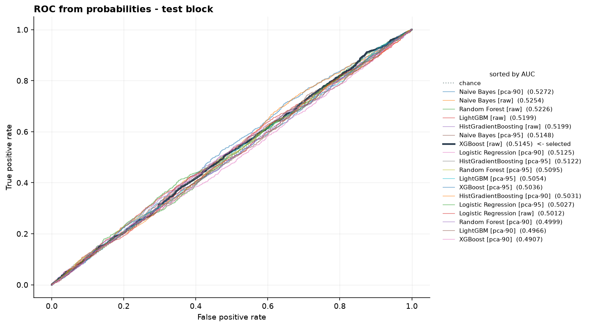
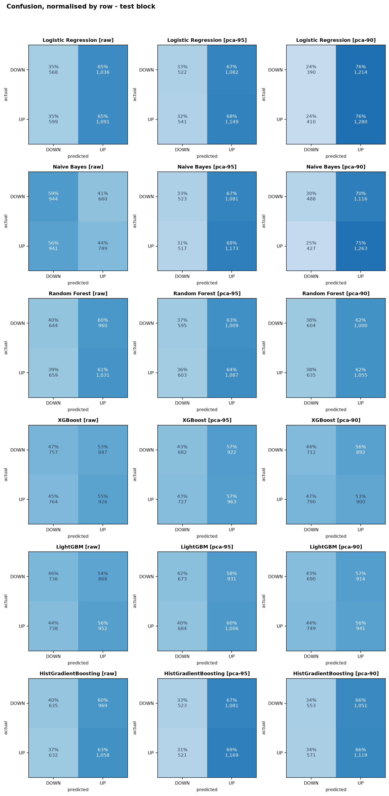

# STATUS 2026-08-24 - The original's conclusion, reproduced and then dismantled

- **Question:** with every correction in place, does a model beat the rule it has to beat? And does the corrected pipeline reach the same verdict the original did, by a different route?
- **Verdict:** **Nothing tested beats the constant predictor by a margin this design can distinguish from chance, and on twice the data no configuration reaches the accuracy at which trading would pay for itself.** The selected model scores -0.21% on the reference data and +0.15% on the canonical data - the sign flips and both are far inside the noise (sec. 6). Which model gets selected turns out to depend on two feature columns (sec. 5).
- **Command:** `forecast-lab train --target XAUUSD --timeframe 1H --dir data/reference`
- **Machine-readable output:** [model-comparison.json](model-comparison.json)
- **Inputs:** `reference/*.csv`, hashed in [data-manifest.json](data-manifest.json). 22,982 rows x 19 columns, focus mode.

## 1. The headline

| | Model chosen | Accuracy | Baseline | Edge |
|---|---|---:|---:|---:|
| **Original** (`Proyecto_Final_Completo`) | LightGBM (PCA) | 51.53% | 51.86% | **-0.33%** |
| **This pipeline** | XGBoost (raw) | 51.09% | 51.31% | **-0.21%** |
| *the same pipeline, two features earlier* | LightGBM (raw) | 50.67% | 51.31% | **-0.64%** |

The third row is not a footnote: it is the same code on the same data, run before two realised-volatility columns were added. **The conclusion held and the winner did not.** Section 5 is about that, and it is the most useful thing this log contains.

## 2. Selection, and the 2.06 points that hang on where you look

This is the section that matters, because it puts a number on an argument that is usually made in words.

| Chosen by | Model | Edge on test |
|---|---|---:|
| **Validation AUC** (this pipeline) | XGBoost [raw] | **-0.21%** |
| **Test AUC** (what the original did) | Naive Bayes [pca-90] | **+1.85%** |

Same data. Same eighteen configurations. Same test block. **The two procedures differ by 2.06 points** - far larger than any effect this project could plausibly detect - and the entire difference is produced by *when* the test set was consulted.

Had this pipeline used `results_df['Test_AUC'].idxmax()`, as `Proyecto_Final_Completo` does, it would have reported a Naive Bayes model beating chance by nearly two points and had every appearance of a finding.

## 3. Is the +1.85% real?

No, and the arithmetic is simple enough to check by hand.

| | Value |
|---|---:|
| Configurations scored on test | **18** |
| Rows per block | 3,294 |
| Standard error of one accuracy | 0.8712% |
| Expected maximum of 18 draws under the null | **1.82 sigma = +1.59%** |
| Best observed | **+1.85% = 2.13 sigma** |
| Holm threshold for the most significant of 18 | z >= 2.77 (p < 0.00278) |
| p-value of the best | **0.0168 - does not survive** |

The best of eighteen is roughly where the best of eighteen coin flips would land. It is slightly above the expectation and comfortably short of the threshold that accounts for having looked eighteen times.

**And the tell is in the count.** Only **5 of 18** configurations have a positive edge on test. Under a true null one would expect about 9. If there were a real edge in this data at this horizon, more than a quarter of the configurations would find some of it.

## 4. The full comparison

**Validation** (baseline 52.46% - this is the block selection is allowed to see):

| Model | Repr. | Accuracy | Edge | AUC |
|---|---|---:|---:|---:|
| XGBoost | raw | 50.88% | **-1.58%** | 0.5222 |

**Not one configuration beats the constant predictor on validation.** The best of eighteen, on the block where selection is honest, is 1.58 points behind a rule with no parameters.

**Test** (baseline 51.31%), the four highest by AUC:

| Model | Repr. | Accuracy | Edge | AUC |
|---|---|---:|---:|---:|
| Naive Bayes | pca-90 (6) | 53.16% | +1.85% | 0.5272 |

Every AUC sits between 0.491 and 0.527. A model that knew something would not look like this.

## 5. Two features changed the winner

This section exists because of an accident, and it turned out to be the most direct evidence in the log.

[ADR-002](../adr/ADR-002-data-source-and-symbol-set.md) sec. 4 declared that realised volatility would replace VIX - the justification for dropping a symbol that would have cost 55% of the sample. An audit found the feature had never been built: the cost was paid and the substitute never arrived. Building it added two columns, 24-hour and 7-day annualised volatility of log returns, and everything else was left untouched.

| | 17 features | 19 features |
|---|---|---|
| Selected on validation | **LightGBM [raw]** | **XGBoost [raw]** |
| Its edge on test | -0.64% | -0.21% |
| Configurations with a positive edge | 5 of 18 | 5 of 18 |
| Best on test | Naive Bayes [pca-90], +2.00% | Naive Bayes [pca-90], +1.85% |
| Configurations clearing break-even | 2 | 1 |

**Two defensible columns, out of nineteen, changed which of six models wins.** Not by breaking anything - both runs are internally consistent, both pass every gate, and both reach the same conclusion.

That is the finding. If the winner is that unstable, then "LightGBM won" was never a fact about LightGBM. It was a draw from a distribution of near-identical candidates, and the original analysis published exactly such a draw as a discovery. The instability is not a defect in this pipeline; it is what the absence of signal looks like when you go looking for a winner anyway.

It also cost this log its neatest line. The previous version observed that the corrected pipeline selected LightGBM - *the same model the original selected* - and read the coincidence as corroboration. It was not corroboration. It was two draws from the same noise landing on the same number, and two columns were enough to separate them.

**What survives is the part that matters:** the selected model loses to a constant predictor in both runs, 13 of 18 configurations sit below the baseline in both, and every AUC stays between 0.49 and 0.53. The conclusion is robust to the change; the winner is not. Those are different properties and only one of them was ever claimed.

**The methodological consequence is recorded rather than left implicit.** Any feature added from here counts as a trial in the multiplicity accounting, and its effect on the selection is measured before and after, as it was here. A pipeline that adds columns until something wins is the failure this project was built to document.

## 6. The same question, asked of twice the data

The reference exports are the "before" - the original project's own data, on which its baseline is reproduced. The canonical dataset is the engine: 51,147 hourly bars of gold from 2018, against 23,181. Both were run through the identical pipeline.

| | reference (23,181 bars) | canonical (51,147 bars) |
|---|---|---|
| Model selected on validation | XGBoost [raw] | Random Forest [raw] |
| Its edge on test | **-0.21%** | **+0.15%** |
| Minimum detectable effect (80%) | 2.17% | **1.46%** |
| Is the edge inside the noise? | yes | yes |
| Configurations clearing break-even (51.92%) | 1 of 18 | **0 of 18** |
| Best edge on test | +1.85% (z = 2.13) | +0.55% (z = 0.94) |
| Survives Holm for 18 tests (z >= 2.77) | no | no |
| Range of AUC across 18 configurations | 0.491 - 0.527 | **0.503 - 0.516** |

**The sign flips.** On one dataset the selected model loses by 0.21 points; on the other it wins by 0.15. Both are far inside their own resolution. This is the cleanest demonstration the project has produced that **the sign of a result this size carries no information** - and it is worth holding beside the original analysis, which reported a difference of the same order and read it as a discovery.

**Everything narrows, which is what absence of signal looks like when the sample grows.** The AUC range compresses from 0.036 to **0.013**, squeezing against 0.5 from both directions. The best edge on test falls from +1.85% to +0.55%: with more bars there is less room for noise to accumulate at the extreme. And **not one configuration of eighteen clears break-even**, where the smaller sample had one.

**One number goes the other way and is worth stating plainly:** 12 of 18 configurations have a positive edge on the canonical data, against 9 expected under a null. That looks like something until the magnitudes are read - the best of the twelve is 0.94 standard errors from zero. It is a cluster of near-zeros that happens to fall on the positive side, not a signal; that block's baseline (50.93%) is simply easier to graze than the reference block's (51.31%). Reported here rather than omitted, because a count that leans the wrong way for the conclusion is exactly the kind of thing this project exists to keep in view.

**What this establishes, precisely.** Nothing tested beats the constant predictor by a margin this design can distinguish from chance, and with twice the data **no configuration reaches the accuracy at which trading would pay for its own costs**. That is firmer than the single-dataset result and narrower than "there is no edge" - which remains unproven, because an MDE of 1.46 points would still miss a real edge of, say, 0.8. Walk-forward validation, which scores roughly three times as many bars, is what closes that last gap.

## 7. What the charts show that the tables did not


Thirteen of eighteen configurations fall below the constant predictor. One clears break-even - Naive Bayes at pca-90, 53.16% - and it is the single draw section 3 has just shown to be indistinguishable from the best of eighteen coin flips. The selected model is the dark bar, below both lines.



Eighteen curves, all of them lying on the diagonal. The original drew this panel too - but from hard labels, which gives every curve one interior point and produced its Naive Bayes AUC of exactly 0.5000.



**This is the one that renders something no table did.** Read each panel by row: in almost every model the DOWN row and the UP row are the same. Logistic Regression [raw] predicts UP 65% of the time when price fell, and 65% of the time when price rose. The prediction is independent of the answer.

Quantified across all eighteen: the median gap between recall and (1 - specificity) is **0.0148**. That difference is Youden's J, so a median of 0.015 corresponds to an AUC of about 0.507 - which is what the ROC panel above shows from the other direction. Normalising by row is what makes it visible; raw counts would hide it behind the class imbalance.

## 8. A correction to ADR-006

[ADR-006](../adr/ADR-006-features-and-stationarity.md) sec. 2 called price levels "the plainest explanation" for the original's PCA collapsing 63 features into 6 components. That was too quick.

Measured here, with every price level already removed: **PCA at 90% variance retains 6 components from 17 features; at 95% it retains 7.** The same absolute number, from a quarter of the columns. Technical indicators computed from a single price series are intrinsically redundant - they are transformations of the same closes - and the levels made that worse rather than causing it. The ADR is corrected rather than left standing.

## 9. What this run says about the project's thesis

**The original's conclusion is refuted, but not by finding the opposite.** It is refuted by showing that its number was the maximum of thirty draws taken from a design that cannot resolve the effect it claimed. This run reproduces that: the maximum of eighteen draws here is +1.85%, and the honest procedure applied to the same data gives -0.21%.

**"No edge" is not what this shows either**, and the log will not claim it. Over the 3,294 scored bars one standard error is 0.87 points, so the minimum detectable effect at 80% power is **2.17 points**; the honest result is -0.21 points, comfortably inside the range this design cannot resolve. What has been established is narrower and firmer: *nothing here clears the bar, and this design could not tell if something barely did.* Walk-forward validation, which scores roughly 11,590 bars instead of 3,294, is the next piece of work, and it exists precisely to make the second half of that sentence go away.

## 10. Is it reproducible?

Byte for byte, yes - but only after fixing something that four runs of the command exposed and no test would have.

```
corrida 1: 19106 bytes  sha=7fb10e7ad44d8dbb8d37ae90
corrida 2: 19106 bytes  sha=7fb10e7ad44d8dbb8d37ae90
corrida 3: 19106 bytes  sha=7fb10e7ad44d8dbb8d37ae90
corrida 4: 19106 bytes  sha=7fb10e7ad44d8dbb8d37ae90
```

**Before the fix, three consecutive runs produced three different hashes.** The cause was `RandomForestClassifier(n_jobs=-1)`, the original's setting: with the work spread across cores, 100 tree votes are summed in whatever order the workers finish, and floating-point addition is not associative. Probabilities moved by up to **3.3e-16** - the last bit of a float64 - and one Brier score in the JSON gained or lost a digit.

Nothing about any conclusion changed, and that is exactly why it mattered. A discrepancy that changes no conclusion is one nobody investigates, so it stays; and a repository arguing that a published number must recompute identically cannot have its own headline command return different bytes each time.

`n_jobs` is not a hyperparameter - `random_state` fixes every tree, so the forest is identical either way and only the summation order changes. The cost is 0.29s against 3.04s per fit, taking the command from about six seconds to twelve. A test now pins it with `array_equal` rather than `allclose`, because approximate equality is what let the problem go unnoticed in the first place. All six estimators were then checked: all deterministic.

## 11. What changed in the repository

- `research/models/` exists: `catalogue.py`, `training.py`, `metrics.py`, with 17 tests, including two that pin the leaks a passing suite would miss and three that pin bit-level reproducibility.
- **Realised volatility exists**, which ADR-002 had declared built since 2026-08-18 and was not (sec. 5).
- The `train` command exists, with `--json` and `--no-pca`.
- The layering guard now quarantines `sklearn`, `lightgbm` and `xgboost` to `research/models/`, for the same reason `ta` is quarantined: none ships type information.
- **Eight figures are committed** under `docs/status/figures/`, regenerated by `train --figures` (ADR-008).
- **Random Forest is fitted single-threaded**, so the command is byte-reproducible (sec. 10).
- **LightGBM and XGBoost were unavailable on this machine and are not any more.** An application control policy refused their native DLLs. The fix was a version pin rather than code: 4.7.0 and 3.4.1 are refused, 4.6.0 and 3.0.5 load first try, because the policy judges a binary's reputation and a freshly published wheel has none. Without that diagnosis, this log would have compared four models and quietly omitted the one the original selected.
